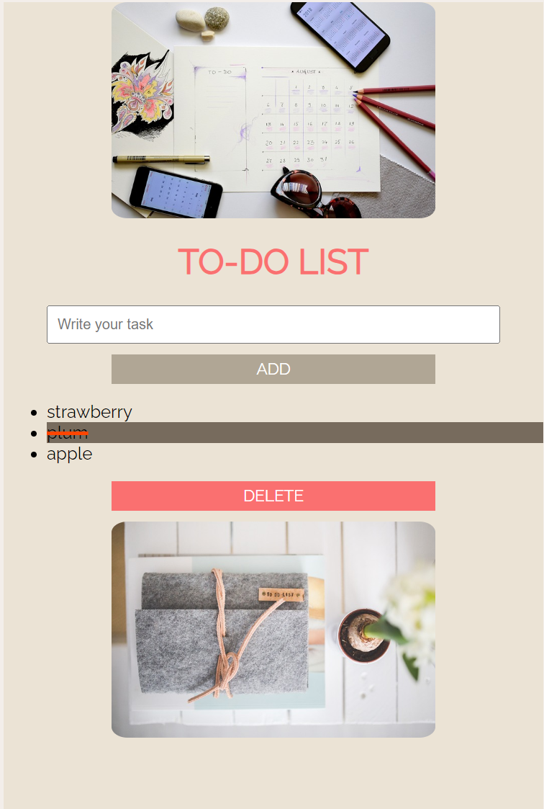

[![Contributors][contributors-shield]][contributors-url]
[![Forks][forks-shield]][forks-url]
[![Stargazers][stars-shield]][stars-url]

# TO-DO-LIST
_________________________
## About The Project

**TO-DO-LIST :bowtie:** - this is an opportunity to make your own to-do list, cross off things as they are completed

link https://thunderous-kheer-7c7474.netlify.app

## Installation

**TO-DO-LIST** no installation required

## Built With
* [![React][React.js]][React-url]

## Usage
to add tasks to the list and delete completed tasks

## Example

## Contributing
Bug reports and/or pull requests are welcome

## License
The application is created for educational purposes. 
Copyright belongs to the school Canshecode
linc https://edu-canshecode.thinkific.com/